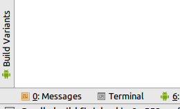

(writing in progress)

# Add CDep Dependencies to an Existing Android Studio CMake Project
This tutorial will show you how to add the first CDep dependency to an existing Android Studio project.
If you'd rather just see a finished example of this then check out [CDep Freetype Sample](https://github.com/jomof/cdep-android-studio-freetype-sample).

This tutorial was tested on Ubuntu but should work on MacOS and Windows. Any changes needed will be noted.

## Setup
This step creates a new Android Studio CMake project to use in this tutorial. If you already have a project to use then you can skip it.

Follow these steps:
1. Start Android Studio 2.2 or later
2. File->New->New project...
3. Click Include C++ Support checkbox
4. Next, next
5. Choose Empty Activity
6. Next, next, finish

## Step 1 -- Clone the cdep-redist project
At this point you should have a project open in Android Studio. Open a terminal window by clicking Terminal. It is usually in the lower part of Android Studio.


 
In the terminal clone the cdep redist project.
```
pushd ..
git clone https://github.com/jomof/cdep-redist.git
popd
```
The folder you choose to clone into doesn't really matter. This tutorial places it in the folder next to the Android Studio project we're working on.

## Step 2 -- Add the CDep wrapper to the Android Studio project
```
../cdep-redist/cdep wrapper
```
If this was successful then you should see output like this.
```
Installing ./cdep.bat
Installing ./cdep
Installing ./bootstrap/wrapper/bootstrap.jar
Installing ./cdep.yml
```
These four files form the CDep 'wrapper'. The files are very small and are meant to be checked in to source control. Briefly, this is the purpose of each file.
* cdep.bat is the cdep wrapper that will run on Windows
* cdep is the cdep wrapper script that will run on Linux and MacOS
* bootstrap/wrapper/bootstrap.jar is a small executable that has a function to download the main cdep executable
* cdep.yml is where you place references to CDep packages

## Step 3 -- Add a reference to SQLite in cdep.yml
Open cdep.yml in Android Studio and replace the existing text there with the following.
```
builders: [cmake]

dependencies:
- compile: com.github.jomof:sqlite:3.16.2-rev51
```
This tells CDep two things:
1. This is a CMake project so generate CMake glue code for the modules
2. This project references SQLite 

## Step 4 -- Use CDep to generate CMake glue code for SQLite
```
./cdep
```
If this worked you should see a message like this.
```
Downloading https://github.com/jomof/sqlite/releases/download/3.16.2-rev51/cdep-manifest.yml
Generating .cdep/modules/cdep-dependencies-config.cmake
```
At this point, CDep has only downloaded the package manifest. The parts of the package needed to build will be downloaded on demand.

## Step 5 -- Modify build.gradle to tell CMake where to find the module glue 
Open the file app/build.gradle in Android Studio (not the root build.gradle) and add the following to the defaultConfig section of that file.
```
defaultConfig {
    externalNativeBuild {
        cmake {
            arguments "-Dcdep-dependencies_DIR=../.cdep/modules"
        }
    }
}
```
After this, Android Studio may prompt you to sync. Don't worry about this yet because we're still making changes. It's okay to sync if you want to get rid of the banner message.


